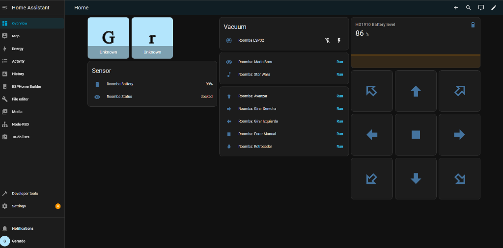
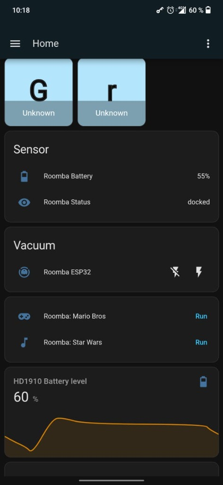
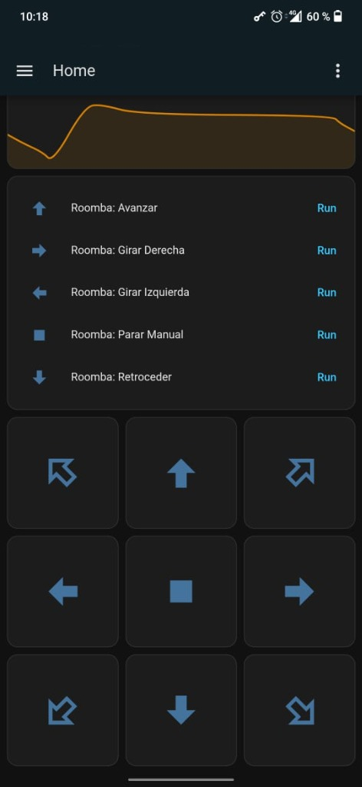
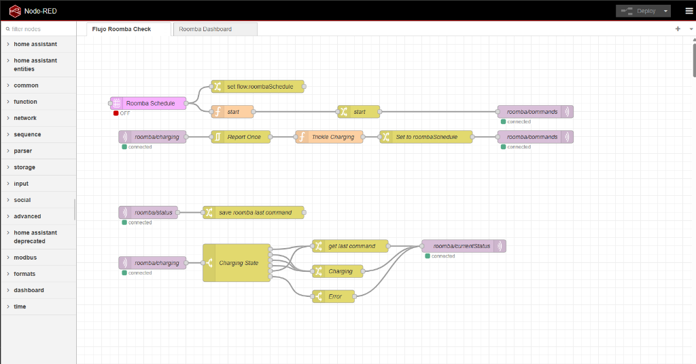
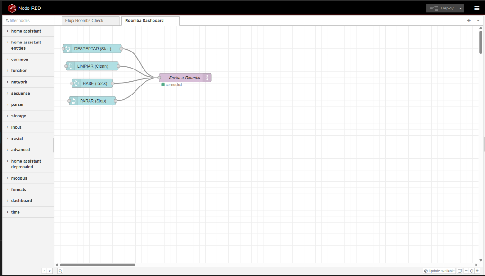

# 🤖 Roomba 500 — ESP32 MQTT Bridge

[](https://platformio.org/)
[](LICENSE)
[](https://www.home-assistant.io/)

An ESP32-based firmware that turns an **iRobot Roomba 500 Series** into a WiFi-connected smart vacuum, fully controllable through **Home Assistant** and **Node-RED** via MQTT.

This project was developed as part of a university thesis on embedded systems and home automation.

---

## ✨ Features

| Feature | Description |
|---|---|
| **MQTT Bridge** | ESP32 acts as a Serial ↔ WiFi bridge between Roomba and your smart home |
| **Manual D-Pad Control** | 8-direction movement (forward, backward, left, right + diagonals) |
| **Battery Monitoring** | Real-time battery level, voltage, and charging status via MQTT |
| **Scheduled Cleaning** | Node-RED scheduler triggers cleaning on weekdays (configurable) |
| **Songs** | Play Star Wars Imperial March or Super Mario Bros theme on the Roomba speaker |
| **OTA Updates** | Flash new firmware over WiFi — no USB cable needed |
| **Failsafe Watchdog** | Auto-stops the robot if MQTT connection is lost (configurable) |
| **Home Assistant Vacuum Entity** | Native vacuum card with Start, Stop, Dock, and Spot commands |

---

## 🏗️ Architecture

```
┌──────────────┐      WiFi/MQTT       ┌─────────────────┐
│  Home Asst.  │ ◄──────────────────► │     ESP32       │
│  + Node-RED  │   roomba/commands    │  (MQTT Bridge)  │
│              │   roomba/estado      │                 │
└──────────────┘                      └────────┬────────┘
                                               │ UART (Serial2)
                                               │ 115200 baud
                                      ┌────────▼────────┐
                                      │   Roomba 500    │
                                      │  (Open Interface)│
                                      └─────────────────┘
```

The ESP32 receives MQTT commands from Home Assistant / Node-RED, translates them into Roomba Open Interface (OI) serial commands, and publishes sensor data back via MQTT.

---

## 🔧 Hardware Requirements

| Component | Notes |
|---|---|
| **ESP32 DevKit** | Any ESP32 development board |
| **iRobot Roomba 500 Series** | Must support Open Interface (OI) |
| **Logic Level Converter** or voltage divider | ⚠️ Roomba TX is 5V, ESP32 RX is 3.3V |
| **Mini-DIN 7-pin cable** | To connect to the Roomba serial port |
| **Jumper wires** | For connections |

### ⚠️ Voltage Warning

The Roomba's TX pin outputs **5V logic**, which can **damage the ESP32's 3.3V GPIO pins**. Always use a **voltage divider** (e.g., 10kΩ + 20kΩ resistors) or a **bidirectional logic level converter** on the RX line.

### Wiring Diagram

| Roomba Mini-DIN Pin | Signal | ESP32 Pin | Notes |
|---|---|---|---|
| Pin 3 | RX (to Roomba) | GPIO 17 (TX2) | Direct connection OK |
| Pin 4 | TX (from Roomba) | GPIO 16 (RX2) | ⚠️ Use level shifter! |
| Pin 5 | Device Detect (BRC) | GPIO 14 | Wake-up signal |
| Pin 6 | GND | GND | Common ground |
| Pin 1 | Vpwr | — | Optional (unregulated battery voltage) |

---

## 💻 Software Requirements

- [**PlatformIO**](https://platformio.org/) (IDE or CLI)
- [**Home Assistant**](https://www.home-assistant.io/) with [Mosquitto MQTT broker](https://github.com/home-assistant/addons/tree/master/mosquitto)
- [**Node-RED**](https://nodered.org/) (optional, for scheduling and dashboard)

### Dependencies (auto-installed by PlatformIO)

- `PubSubClient` by Nick O'Leary — MQTT client
- `ArduinoOTA` — built-in OTA update support

---

## 🚀 Quick Start

### 1. Clone the Repository

```bash
git clone https://github.com/gerardorflammia/roomba-esp32-mqtt-bridge.git
cd roomba-esp32-mqtt-bridge
```

### 2. Configure Credentials

Edit `src/main.cpp` and replace the placeholder values:

```cpp
const char *ssid = "YOUR_WIFI_SSID";         // Your WiFi network name
const char *password = "YOUR_WIFI_PASSWORD";   // Your WiFi password
const char *mqtt_server = "YOUR_MQTT_BROKER_IP"; // e.g. "192.168.1.100"
const char *mqtt_user = "YOUR_MQTT_USER";      // MQTT username
const char *mqtt_password = "YOUR_MQTT_PASSWORD"; // MQTT password
```

### 3. Flash the ESP32

```bash
# First flash (via USB)
pio run --target upload

# Subsequent flashes (via WiFi OTA)
# Uncomment upload_protocol = espota in platformio.ini
# Set upload_port to your ESP32's IP address
pio run --target upload
```

### 4. Configure Home Assistant

Add the contents of `ha_config_backups/configuration_roomba.yaml` to your Home Assistant `configuration.yaml`:

```yaml
mqtt:
  vacuum:
    - name: "Roomba ESP32"
      command_topic: "roomba/commands"
      payload_start: "start"
      payload_stop: "stop"
      payload_return_to_base: "dock"

  sensor:
    - name: "Roomba Battery"
      state_topic: "roomba/estado"
      unit_of_measurement: "%"
      device_class: battery
      value_template: "{{ value_json.battery_level }}"
    - name: "Roomba Status"
      state_topic: "roomba/estado"
      value_template: "{{ value_json.status }}"
```

### 5. Add Movement Scripts

Copy the scripts from `ha_config_backups/scripts.yaml` into your HA scripts configuration.

### 6. Add D-Pad Dashboard Card

Paste the content of `ha_config_backups/dpad_manual_card.yaml` into a Manual Card in your HA dashboard for 8-direction manual control.

### 7. Import Node-RED Flows (Optional)

1. Open Node-RED → Hamburger menu → **Import**
2. Import `dashboards/node_red_flow.json` for the scheduling/automation flow
3. Import `dashboards/roomba_dashboard.json` for the basic dashboard buttons
4. Update the MQTT broker node with your broker IP
5. Deploy

---

## 📡 MQTT Commands Reference

| Command | MQTT Payload | Description |
|---|---|---|
| Start / Clean | `start` or `turn_on` | Wake up Roomba and begin cleaning cycle |
| Stop | `stop` or `turn_off` | Stop all motors (Safe Mode + Drive 0) |
| Clean | `clean` | Start cleaning cycle |
| Dock | `dock` or `return_to_base` | Send Roomba back to charging base |
| Forward | `forward` | Drive forward at 200 mm/s |
| Backward | `backward` | Drive backward at 200 mm/s |
| Turn Left | `left` | Spin left in place |
| Turn Right | `right` | Spin right in place |
| Diagonal Forward-Left | `forward_left` | Gentle left curve |
| Diagonal Forward-Right | `forward_right` | Gentle right curve |
| Diagonal Backward-Left | `backward_left` | Reverse left curve |
| Diagonal Backward-Right | `backward_right` | Reverse right curve |
| Star Wars Theme | `starwars` | Play Imperial March |
| Mario Bros Theme | `mario` | Play Super Mario Bros intro |
| Power Down | `power_down` | Put Roomba to sleep |

### MQTT Topics

| Topic | Direction | Format |
|---|---|---|
| `roomba/commands` | HA → ESP32 | Plain text command |
| `roomba/estado` | ESP32 → HA | JSON: `{"battery_level": 85, "voltage": 16500, "status": "docked", "charging": true}` |

---

## 📸 Screenshots

### Home Assistant — Desktop Dashboard

<p align="center">
  
</p>

### Home Assistant — Mobile App

<p align="center">
  
  
</p>

### Node-RED — Automation Flow

<p align="center">
  
</p>

### Node-RED — Dashboard Buttons

<p align="center">
  
</p>

---

## 📖 Roomba Open Interface Manual

The `roomba_manual/` folder contains the official iRobot documentation:

- **Roomba 500 Series User Manual** — General usage and maintenance
- **Roomba SCI Specification Manual** — Serial Command Interface (opcodes, sensor packets, etc.)

These documents are essential if you want to extend the firmware with additional Roomba commands.

---

## 🛡️ Safety Features

### Failsafe Watchdog
If the ESP32 loses MQTT connectivity, a watchdog timer can automatically send the **STOP** command (Opcode 173) to prevent the Roomba from running uncontrolled. This is disabled by default for testing; uncomment the watchdog section in `loop()` for production use.

### Safe Mode
The firmware operates the Roomba in **Safe Mode** (Opcode 131), which preserves cliff and wheel-drop safety sensors. The robot will automatically stop if it detects a cliff or is picked up.

### Device Detect Wake-Up
The ESP32 controls the Roomba's **Device Detect** (BRC) pin to wake it from sleep mode before sending commands.

---

## 🤝 Contributing

Contributions are welcome! Some ideas for improvement:

- [ ] Add more sensor readings (bump, cliff, wheel drop, wall sensor)
- [ ] Implement spot cleaning mode
- [ ] Add scheduling directly on the ESP32 (no Node-RED dependency)
- [ ] Create an ESPHome-based version
- [ ] Add a web-based configuration portal (WiFiManager)
- [ ] Implement MQTT discovery for auto-configuration in Home Assistant

Feel free to open an issue or submit a pull request.

---

## 📝 License

This project is licensed under the MIT License — see the [LICENSE](LICENSE) file for details.

---

## 🙏 Acknowledgments

- [TheHookUp/MQTT-Roomba-ESP01](https://github.com/thehookup/MQTT-Roomba-ESP01) — Original ESP-01 implementation that inspired this project
- [iRobot Roomba Open Interface Specification](https://www.irobot.com/about-irobot/stem/open-interface) — Official protocol documentation
- [PlatformIO](https://platformio.org/) — Development environment
- [Home Assistant](https://www.home-assistant.io/) — Smart home platform
- [Node-RED](https://nodered.org/) — Flow-based automation
